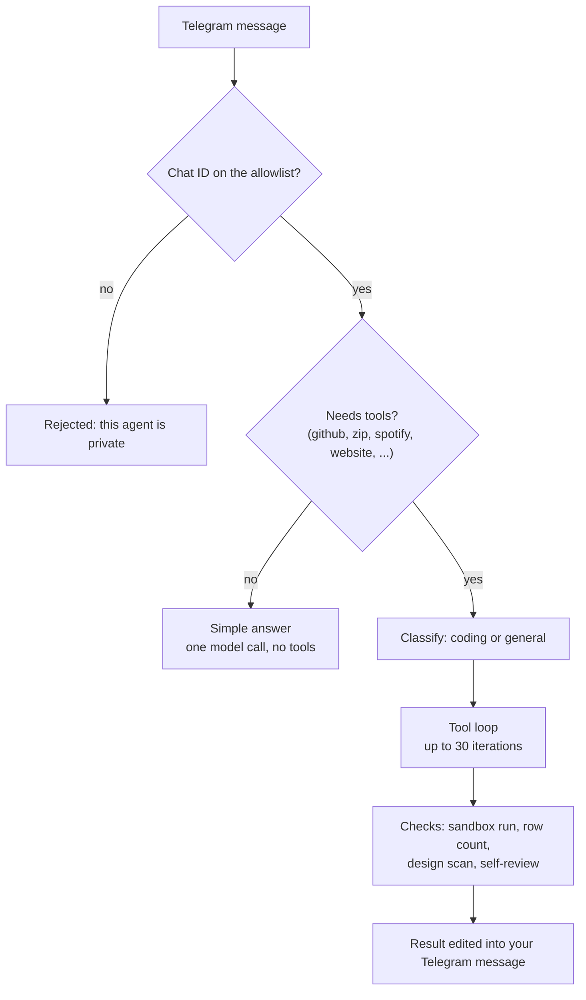
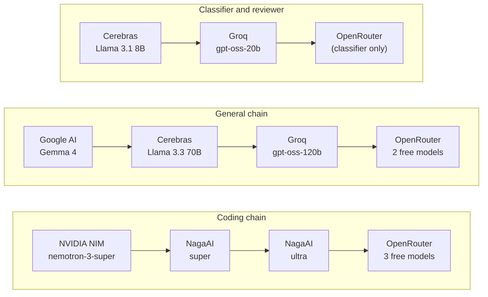
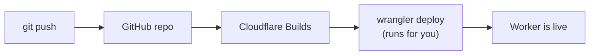
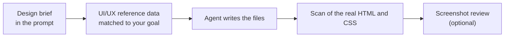

<div align="center">


### Cloudflare Autonomous Agent

A goal-following AI agent that runs entirely on Cloudflare's free tier. You send it a task in Telegram, it plans and executes the steps on its own using a set of tools, and reports back when it is done.

[](https://workers.cloudflare.com/)
[](https://developers.cloudflare.com/workflows/)
[](https://core.telegram.org/bots)
[](#what-it-can-do)
[](LICENSE)
[](https://github.com/basavarajpatil660)

</div>

It is built from two Cloudflare Workers:

- **`agent-router`** — the agent itself. Classifies the goal, runs the tool loop, calls model providers, verifies its own output, and talks to Telegram.
- **`agent-deployer`** — a small, single-purpose worker that pushes a finished multi-file project to a GitHub repository in one batched request.

The split exists for a specific reason, covered under [Subrequest budget](#subrequest-budget).

**Jump to:** [What it can do](#what-it-can-do) · [Deploy](#deploying-the-workers) · [Set up keys](#setting-up-keys) · [Create File](#create-file) · [GitHub](#github) · [Research](#research) · [Design check](#design-check) · [Spotify](#spotify) · [Discord](#discord) · [Config](#configuration)

## What it does

Given a goal such as *"build a three page site for a bakery, write the files, and push them to a repo called corner-bakery"*, the agent will:

1. Classify the goal as a coding or general task.
2. Run a tool loop: writing files, searching the web, running code in a sandbox, taking screenshots, until the goal is met.
3. Check its own work: verify generated code actually runs, confirm the requested number of files or rows were really produced, and scan written CSS/HTML for generic template patterns.
4. Push the result to GitHub and deliver files or a summary back to the Telegram chat.

It runs on Cloudflare Workflows rather than a plain fetch handler, so a run is durable and is not bound by the roughly 30-second limit of a normal request.

### How a message becomes a run



Small talk and quick questions never touch the tool loop. They get a single model call, which also saves subrequests.

## What it can do

53 tools, grouped by what you would actually ask for. Everything is triggered by plain sentences in Telegram. There are no slash commands (a message starting with `/` just gets a reminder to write normally).

| You want to... | Feature | Say something like | Needs |
|---|---|---|---|
| Get a file made and sent to you | [Create File](#create-file) | `write a notes.txt about REST APIs and send it to me` | nothing extra |
| Get several files in one zip | [Create File](#create-file) | `build a 3 file site and zip it` | `AGENT_FILES_REPO` |
| Work with repos, issues, PRs | [GitHub](#github) | `open an issue on corner-bakery: add a menu page` | `GITHUB_TOKEN` |
| Push a whole project to a repo | [GitHub](#github) | `build a bakery site and push it to a repo called corner-bakery` | `agent-deployer` |
| Look something up | [Research](#research) | `find the latest news on Cloudflare Workflows` | `TAVILY_API_KEY` |
| Build a site that doesn't look templated | [Design check](#design-check) | `build a landing page for a night-market food stall` | nothing extra |
| Run and test code | [Code sandbox](#code-sandbox) | `write a python script that reverses a string and run it` | nothing (key optional) |
| See what a page looks like | [Design check](#design-check) | `build the page and screenshot it` | `SCREENSHOT_API_KEY` |
| Control music | [Spotify](#spotify) | `play blinding lights on spotify` | Spotify credentials |
| Post to a Discord channel | [Discord](#discord) | `send "deploy done" to discord channel 123456789012345678` | `DISCORD_BOT_TOKEN` |
| Find videos, read a transcript | [YouTube](#youtube) | `find a video on Workers KV limits` | `YOUTUBE_API_KEY` (search only) |
| Check mail and calendar | [Gmail and Calendar](#gmail-and-calendar) | `summarise my unread mail` | Google credentials |
| Remember things between runs | [Memory](#memory) | `remember my main repo is corner-bakery` | `AGENT_MEMORY` KV |

If a tool's credentials are missing, the agent reports that tool as unavailable and carries on with the rest.

### Which actions ask before running

Some tools pause and send a **Confirm / Cancel** button to your Telegram chat. Nothing happens until you tap Confirm, and if you don't answer within 5 minutes the action is skipped.

| Asks first | Runs straight away |
|---|---|
| `spotify_play`, `spotify_pause`, `spotify_skip` | Creating files and repos |
| `discord_send_message` | Writing and deploying to GitHub |
| `github_delete_file` | Issues, PRs, merges, releases, collaborators |
| `github_delete_repo` | Everything read-only (search, lookup, Gmail, Calendar, YouTube) |

Confirmation needs a Telegram chat, so these tools only work when the run starts from Telegram or `POST /agent`, not from the `GET /prompt/...` shortcut.

## Design notes

A few decisions are worth explaining, because they are the result of specific failures rather than preference.

**It fails loudly instead of claiming success.** Language models will happily report that they finished a task they only described. Several checks exist purely to catch this: intent-only detection (an answer that announces a plan but wrote no files), row-count verification against what the goal asked for, a deploy check that confirms a push actually succeeded, and sandbox verification that refuses to present code as working when it did not run. Each of these throws a visible error rather than delivering a confident but false result.

**Destructive actions are gated twice.** `github_delete_repo` and `github_delete_file` require the target to be named in the current message, along with actual deletion wording, never just in replayed memory. They also pause for a Telegram confirmation button. This exists because an early version deleted a repository that only appeared in prior conversation context.

**Memory is time-scoped.** Old goals are not replayed into unrelated new ones. After a configurable idle gap (30 minutes by default) the next message is treated as a fresh session, and short casual messages skip memory injection entirely.

**Repeat calls don't repeat side effects.** Tools that change something (writes, deploys, issues, Spotify, Discord) are remembered per run. If the model asks for the exact same call twice, the second one is skipped and returns the first result.

## Architecture

```
Telegram ──▶ agent-router (Cloudflare Workflow)
                │
                ├─▶ model providers   (fallback chains, free tiers)
                ├─▶ GitHub API        (read, write, repo management)
                ├─▶ Workers KV        (memory, stats, file index)
                ├─▶ Judge0            (code sandbox)
                ├─▶ Tavily            (web search)
                ├─▶ Spotify, Discord, YouTube, Gmail, Calendar
                │
                └─▶ agent-deployer ──▶ GitHub API (batched multi-file push)
```

`agent-router` holds all reasoning. `agent-deployer` has no model access, no memory and no Telegram integration. It receives exact paths and exact bytes and writes them. That keeps the component holding write access to your repositories small enough to audit in one sitting.

See [docs/ARCHITECTURE.md](docs/ARCHITECTURE.md) for the request flow, agent loop and verification passes in detail.

### Provider fallback chains

Each logical model call walks a chain until one provider responds. At most three are attempted per call, so one flaky provider can't consume the whole subrequest budget. A provider with no API key set is skipped.



The chains live at the top of `agent-router/src/worker.js`. Free-tier model names change often, so that file is the source of truth.

## Subrequest budget

This is the main constraint the project is designed around, and the reason for the two-worker split.

On the Cloudflare **free plan**, a Worker or Workflow gets **50 external subrequests per invocation**, and the limit applies **per Workflow instance, not per step**. Every step in a run draws from one shared pool. Internal Cloudflare services such as KV, D1 and R2 have a separate 1,000 per invocation budget and do not count against the 50.

Every external call shares that 50: each model call, each GitHub request, each Telegram message, each web search. An agent loop of 30 iterations spends at least 30 of them on model calls before doing any real work.

The project handles this in three ways:

- **Explicit accounting.** Every external `fetch` is counted. 8 subrequests are held in reserve so a run that exhausts its budget can still report what happened instead of going silent mid-notification.
- **Batching.** Tool-call logging is buffered and flushed as a single request rather than one per call. Model tool definitions are filtered by goal relevance, so unused integrations are not serialised into every request.
- **A separate budget for deploys.** Pushing a project to GitHub is the most subrequest-heavy step, so it runs in `agent-deployer` with its own fresh 50, invoked from `agent-router` as a single subrequest.

Be aware of the ceiling this leaves. A large multi-file build genuinely may not fit in 50 external subrequests. When that happens the run fails with a message naming the real limit rather than an opaque "Too many subrequests" error. Raising the limit requires a paid plan and the `limits.subrequests` setting in `wrangler.jsonc`.

## Security

Read this before deploying. The agent operates with a GitHub token and can create and delete repositories.

- **Both entry points fail closed.** Telegram requests are rejected unless the sender's chat ID is listed in `TELEGRAM_ALLOWED_CHAT_IDS`. The HTTP API is disabled entirely until `AGENT_API_SECRET` is set. Neither defaults to open. Confirm buttons are also only accepted from allowlisted chats.
- **Scope the GitHub token to what you need.** The agent creates repos (its own storage repo, deploy targets), so a token limited to a fixed list of existing repos will fail on creation. Either create those repos yourself and use a fine-grained token limited to them, or use a token that can create repos. Only add `delete_repo` if you actually want the agent able to delete repositories.
- **Use `BLOCKED_REPOS`.** The set at the top of `agent-router/src/worker.js` names repositories the agent must never write to or delete, regardless of instruction. Populate it with anything you cannot afford to lose.
- **Set `TELEGRAM_WEBHOOK_SECRET`.** Telegram will then sign each webhook delivery, and the worker rejects anything that did not come from Telegram.
- **Know what runs without asking.** Merging a PR, closing an issue and adding a collaborator do not use a confirm button (see the [table above](#which-actions-ask-before-running)). If that makes you uncomfortable, scope the token down.

To report a vulnerability, see [SECURITY.md](SECURITY.md).

## Requirements

- A Cloudflare account (the free plan is sufficient)
- A **GitHub account**. The workers deploy from GitHub, and the agent itself pushes to GitHub too
- Node.js 18 or newer, and [Wrangler](https://developers.cloudflare.com/workers/wrangler/), only needed for the manual deploy path below; the GitHub-connected path needs neither
- A Telegram bot token from [@BotFather](https://t.me/BotFather)
- A GitHub token
- At least one model provider API key per chain (see [Model providers](#model-providers))

## Deploying the workers

> **Read this first.** Each worker has to be **connected to a GitHub repo**. That connection is what turns a `git push` into a live deploy. Skip it and you have code sitting in a repo and nothing running.



There are two ways to deploy each worker. Pick one per worker, you don't need both.

### Option A: GitHub-connected (Cloudflare Builds, no local CLI)

This is how the project runs in production. Each worker lives in its own GitHub repo, wired to a Cloudflare Worker through **Cloudflare Builds**. A `git push` alone triggers the build and deploy. No local `wrangler deploy`, no project pulled to your machine.

1. Put each worker in a GitHub repo (or a path inside one): `agent-deployer` and `agent-router`.
2. In the Cloudflare dashboard, create a Worker for each and connect it to its repo under **Settings → Builds**. Cloudflare will ask you to authorise its GitHub app the first time.
3. Set the secrets and vars for each worker in the dashboard (**Settings → Variables and Secrets**). [Setting up keys](#setting-up-keys) walks through every one.
4. Push to the connected branch. Watch the **Deployments** tab on each Worker for the URL and build logs.

Deploy `agent-deployer` first and note its URL. `agent-router` needs it as `DEPLOYER_WORKER_URL`.

From then on, every change is edit, commit, push.

### What the router expects from `wrangler.jsonc`

Builds deploys whatever is in your config, so these bindings have to be in the committed file:

```jsonc
{
  "workflows": [
    { "name": "agent-workflow", "binding": "AGENT_WORKFLOW", "class_name": "AgentWorkflow" }
  ],
  "kv_namespaces": [
    { "binding": "AGENT_MEMORY", "id": "<your-kv-namespace-id>" }
  ],
  "ai": { "binding": "AI" }   // optional, only for the screenshot vision review
}
```

Create the KV namespace once (`wrangler kv namespace create AGENT_MEMORY`, or in the dashboard under **Storage & Databases → KV**) and paste its id in.

### Option B: Manual (local Wrangler CLI)

#### 1. Clone and install

```bash
git clone https://github.com/<your-username>/cloudflare-autonomous-agent.git
cd cloudflare-autonomous-agent
npm install
```

#### 2. Deploy `agent-deployer` first

`agent-router` needs its URL.

```bash
cd agent-deployer
cp .dev.vars.example .dev.vars   # local development only

wrangler secret put GITHUB_TOKEN
wrangler secret put DEPLOY_SHARED_SECRET   # openssl rand -hex 32

# Set GITHUB_DEFAULT_OWNER in wrangler.jsonc, then:
wrangler deploy
```

Note the deployed URL, for example `https://agent-deployer.<your-subdomain>.workers.dev`.

#### 3. Create the KV namespace

```bash
cd ../agent-router
wrangler kv namespace create AGENT_MEMORY
```

Paste the returned `id` into `agent-router/wrangler.jsonc`.

#### 4. Configure and deploy `agent-router`

Edit `wrangler.jsonc` and set `GITHUB_DEFAULT_OWNER` and `AGENT_FILES_REPO`, then set the secrets:

```bash
wrangler secret put TELEGRAM_BOT_TOKEN
wrangler secret put TELEGRAM_ALLOWED_CHAT_IDS   # e.g. 123456789
wrangler secret put AGENT_API_SECRET            # openssl rand -hex 32
wrangler secret put GITHUB_TOKEN
wrangler secret put DEPLOYER_WORKER_URL
wrangler secret put DEPLOY_SHARED_SECRET        # same value as agent-deployer

# At least one coding provider and one general provider
wrangler secret put OPENROUTER_API_KEY
wrangler secret put GOOGLE_AI_API_KEY

wrangler deploy
```

### 5. Register the Telegram webhook

Needed either way, once both workers are deployed.

```bash
curl "https://api.telegram.org/bot<BOT_TOKEN>/setWebhook" \
  -H "Content-Type: application/json" \
  -d '{
    "url": "https://agent-router.<your-subdomain>.workers.dev/telegram/webhook",
    "secret_token": "<TELEGRAM_WEBHOOK_SECRET>"
  }'
```

If you set `secret_token`, store the same value as the `TELEGRAM_WEBHOOK_SECRET` secret on `agent-router`.

### 6. Verify

Send your bot: `write a short notes.txt explaining what a REST API is and send me the file`. You should get an acknowledgement, then the file. If that works, the whole chain (Telegram, worker, model, file delivery) is alive.

## Setting up keys

Every key below is optional except the ones under [Required](#required). Add only what you want to use.

**Where a key goes.** Anything secret (tokens, API keys) is stored as a **Secret**. Plain settings like `GITHUB_DEFAULT_OWNER` are ordinary variables.

| | Dashboard | CLI |
|---|---|---|
| Secret | Worker → **Settings → Variables and Secrets → Add**, type **Secret** | `wrangler secret put NAME` |
| Plain variable | same page, type **Text**, or the `vars` block in `wrangler.jsonc` | edit `wrangler.jsonc` |

Keep plain variables in `wrangler.jsonc`. When a worker deploys from config, values typed only into the dashboard can get overwritten. Secrets are safe.

<details>
<summary><b>Telegram bot token and your chat ID</b></summary>

1. Open [@BotFather](https://t.me/BotFather), send `/newbot`, follow the prompts, copy the token. That is `TELEGRAM_BOT_TOKEN`.
2. Send any message to your new bot.
3. Open `https://api.telegram.org/bot<TOKEN>/getUpdates` in a browser and find `"chat":{"id": ...}`. That number is your chat ID.
4. Set `TELEGRAM_ALLOWED_CHAT_IDS` to it. For more than one person, separate IDs with commas.

</details>

<details>
<summary><b>GitHub token</b></summary>

1. GitHub → **Settings → Developer settings → Personal access tokens**.
2. Simplest option: a classic token with the **`repo`** scope. Add **`delete_repo`** only if you want repo deletion available.
3. Set it as `GITHUB_TOKEN` on **both** workers.

If you prefer a fine-grained token, remember it needs to be able to create repositories, since the agent creates its storage repo and deploy targets.

</details>

<details>
<summary><b>Model provider keys</b></summary>

You need at least one key for the coding chain and one for the general chain. `OPENROUTER_API_KEY` covers both, which makes it the easiest single key to start with.

| Secret | Get it from | Used by |
|---|---|---|
| `NVIDIA_API_KEY` | build.nvidia.com | coding chain |
| `NAGA_API_KEY` | naga.ac | coding chain |
| `OPENROUTER_API_KEY` | openrouter.ai | coding, general, classifier |
| `GOOGLE_AI_API_KEY` | aistudio.google.com | general chain (Gemma) |
| `CEREBRAS_API_KEY` | cloud.cerebras.ai | general, classifier, reviewer |
| `GROQ_API_KEY` | console.groq.com | general, classifier, reviewer |

The more keys you add, the more fallbacks there are when a free tier rate-limits you.

</details>

<details>
<summary><b>Spotify</b></summary>

Needs a Spotify **Premium** account, since playback control is a Premium feature.

1. Go to the [Spotify Developer Dashboard](https://developer.spotify.com/dashboard) and create an app. Add `http://127.0.0.1:8888/callback` as a redirect URI. The page never has to load, it only has to match.
2. Open the app's settings and copy the **Client ID** and **Client secret**.
3. Paste this into your browser, with your Client ID filled in, and approve:

```
https://accounts.spotify.com/authorize?client_id=<CLIENT_ID>&response_type=code&redirect_uri=http%3A%2F%2F127.0.0.1%3A8888%2Fcallback&scope=user-modify-playback-state%20user-read-playback-state
```

4. The browser lands on a page that fails to load. That's fine. Copy the value after `code=` from the address bar. It works once and expires quickly, so do step 5 right away.
5. Exchange it for a refresh token:

```bash
curl -X POST https://accounts.spotify.com/api/token \
  -u "<CLIENT_ID>:<CLIENT_SECRET>" \
  -d grant_type=authorization_code \
  -d code=<CODE> \
  -d redirect_uri=http://127.0.0.1:8888/callback
```

6. Copy `refresh_token` from the response and set three secrets on `agent-router`:

```
SPOTIFY_CLIENT_ID
SPOTIFY_CLIENT_SECRET
SPOTIFY_REFRESH_TOKEN
```

The worker uses the refresh token to get a fresh access token on every call, so nothing else expires.

</details>

<details>
<summary><b>Discord bot token</b></summary>

1. Go to the [Discord Developer Portal](https://discord.com/developers/applications) and click **New Application**.
2. Open the **Bot** tab, click **Reset Token**, and copy it. That is `DISCORD_BOT_TOKEN`.
3. Open **OAuth2 → URL Generator**. Tick the **bot** scope, then the permissions **View Channels** and **Send Messages**.
4. Open the generated URL and add the bot to your server.
5. In Discord, turn on **Settings → Advanced → Developer Mode**. Right-click the channel you want, then **Copy Channel ID**.

The agent only sends messages, so you don't need any privileged intents. The bot must be able to see the channel, so check the channel's own permissions if it can't post.

</details>

<details>
<summary><b>YouTube API key</b></summary>

Only needed for `youtube_search`. Transcripts work without a key.

1. In [Google Cloud Console](https://console.cloud.google.com/), create a project.
2. Enable **YouTube Data API v3**.
3. **Credentials → Create credentials → API key**. Set it as `YOUTUBE_API_KEY`.

A search costs 100 units of the default 10,000 daily quota.

</details>

<details>
<summary><b>Google (Gmail and Calendar)</b></summary>

Both tools share one set of credentials and are read-only.

1. In Google Cloud Console, use a project (the YouTube one is fine) and enable **Gmail API** and **Google Calendar API**.
2. Set up the **OAuth consent screen**, then **Credentials → Create credentials → OAuth client ID → Web application**. Add `https://developers.google.com/oauthplayground` as an authorised redirect URI. Copy the client ID and secret.
3. Open the [OAuth Playground](https://developers.google.com/oauthplayground). Click the gear icon, tick **Use your own OAuth credentials**, and paste the client ID and secret.
4. In step 1 of the Playground, enter these two scopes and click **Authorize APIs**:

```
https://www.googleapis.com/auth/gmail.readonly
https://www.googleapis.com/auth/calendar.readonly
```

5. In step 2, click **Exchange authorization code for tokens** and copy the **refresh token**.
6. Set three secrets on `agent-router`:

```
GOOGLE_CLIENT_ID
GOOGLE_CLIENT_SECRET
GOOGLE_REFRESH_TOKEN
```

**Heads up:** if the consent screen is in *Testing* mode, Google expires the refresh token after 7 days. Set the publishing status to **In production** (you'll see an "unverified app" warning for your own account, that's normal for personal use) so it keeps working.

</details>

<details>
<summary><b>Web search, screenshots, sandbox, email alerts, sheet logging</b></summary>

| Secret | Get it from | Notes |
|---|---|---|
| `TAVILY_API_KEY` | app.tavily.com | Turns on `web_search` and `web_search_news` |
| `SCREENSHOT_API_KEY` | screenshotmachine.com | Turns on `html_to_screenshot`. Add the `AI` binding for a vision review |
| `JUDGE0_API_KEY` | RapidAPI (Judge0 CE) | Optional. Without it the sandbox uses the public Judge0 endpoint. `JUDGE0_API_HOST` overrides the RapidAPI host |
| `RESEND_API_KEY`, `NOTIFY_EMAIL` | resend.com | Emails you when a run fails. `RESEND_FROM` sets the sender |
| `SHEET_WEBHOOK_URL` | Google Apps Script | Logs every action to a sheet, see below |

A minimal Apps Script for the sheet. The worker sends tool logs batched as `{ "batch": [...] }` and run-level events as a single object, so handle both:

```js
function doPost(e) {
  const body = JSON.parse(e.postData.contents);
  const rows = body.batch || [body];
  const sheet = SpreadsheetApp.getActiveSheet();
  rows.forEach(r => sheet.appendRow([r.timestamp, r.action, r.goal, r.status, r.detail]));
  return ContentService.createTextOutput("ok");
}
```

Deploy it as a Web app with access set to **Anyone**, and use the resulting URL as `SHEET_WEBHOOK_URL`.

</details>

## Using the features

### Create File

The simplest thing the agent does, and probably the one you'll use most. It writes a file and sends it straight into your Telegram chat, so you never touch a repo or a terminal.

```
You    ▸ make me a todo.csv with 25 rows: task, priority, due date, and send it to me
Agent  ▸ 🤖 Agent working on: make me a todo.csv ...
Agent  ▸ 📎 todo.csv                      (arrives as a document)
Agent  ▸ (edits the first message)  Done. todo.csv has 25 rows ...
```

A few tools work together here:

| Tool | What it does |
|---|---|
| `send_telegram_file` | Delivers a file into the chat as a document. This is the "send it to me" part |
| `write_file` | Saves a file in your storage repo (`AGENT_FILES_REPO`) and returns its path. Used when files need to be zipped or deployed later |
| `archive_repo_zip` | Bundles files you've written into a real `.zip` and sends it to the chat |
| `list_files`, `read_file`, `delete_file` | See, re-open and remove what the agent has saved |

**Getting good results**

- **Name the file and format.** `notes.txt`, `todo.csv`, `report.md`. Without one the agent picks.
- **Say the size when it matters.** Ask for "25 rows" of a csv and the agent counts the real rows in the file it wrote. If it's more than 5% short, it goes back and appends the rest. If it still can't reach the number, the run fails with the real count instead of pretending.
- **Big files are fine.** They're built across several calls that append to the same file, up to 200,000 characters per file.
- **Want a bundle?** Say `zip them`. If your message contains the word zip or archive, the agent isn't allowed to finish without building one.
- **Later:** `list my files`, then `send me todo.csv again`. Use a different name if you want a fresh copy, because each filename can only be sent once per run.

**Good to know**

- The agent can't fake an archive. Naming a `.zip` in `send_telegram_file` is rejected, it has to go through `archive_repo_zip`.
- Filenames are cleaned to letters, digits, dots, dashes and underscores.
- The storage repo is created for you as **private** the first time it's needed. That means the raw links the agent returns won't open in a browser unless you make the repo public. Telegram delivery always works.

### GitHub

Full read and write, not just "push code".

| Area | What it can do |
|---|---|
| Files | read, create, update, delete, list a repo's tree |
| Repos | create, list (with a count), update description/topics/visibility, delete |
| Branches and commits | list and create branches, list commits, inspect one, compare two refs |
| Issues | list, create, comment, close or reopen |
| Pull requests | list, open, merge (merge, squash or rebase) |
| Releases | list, publish with a tag |
| People | look up a profile, list and invite collaborators |
| Search | find repos and code across GitHub |
| Health | check your API rate limit |

```
create a private repo called corner-bakery
open an issue on corner-bakery: add a menu page
compare main and redesign on corner-bakery, then open a pull request
merge pull request 3 on corner-bakery with squash
cut a v1.0.0 release for corner-bakery
how many repos do I have?
```

**Tip:** to save tokens, the agent is only handed the GitHub tools your message hints at. The core ones (create, list, write, delete, read tree, look up) are always there. Issue, PR, branch, commit, release, collaborator, search and repo-settings tools show up when your message contains words like *issue*, *pull request*, *branch*, *commit*, *release*, *collaborator*, or *search github*. So say what you mean in plain words.

**Deploying a whole project.** Ask for a build and say *push* or *deploy* plus *repo*. The agent writes each file, then calls `agent-deployer` once with the list of paths. It refuses to finish until a push has actually succeeded. One call takes up to 20 files. For more, it splits the deploy across calls, and if the deployer runs out of its own budget it reports exactly which files were skipped.

**Deleting.** Repo and file deletes need the exact name in your message, real deletion wording (*delete*, *remove*, *erase*...), and your tap on the Confirm button. `BLOCKED_REPOS` blocks writes and deletes on repos you list, no matter what.

### Research

The agent can look things up instead of guessing.

- **`web_search`** and **`web_search_news`** through Tavily, top 5 results each
- **`fetch_url`** reads a page and returns its visible text (first 2,000 characters), no key needed
- **`github_lookup`** reads a repo's info or one file from it
- **`get_current_datetime`** so it never guesses the date

Results feed the same loop, so you can chain steps:

```
find the latest news on Cloudflare Workflows and write it up as summary.md
read https://developers.cloudflare.com/workflows/ and list the limits
look up the current Node.js version and put it in versions.txt
```

### Design check

Ask the agent for a site, page, poster or logo idea and it doesn't just build the first thing that comes to mind. There are four layers, and **none of them need installing**. They're all inside `worker.js`, so anyone who deploys the code gets them.



**1. A design brief.** Before writing, the agent is told to pick a real 3-5 colour palette, a real font pairing and a layout that fits the subject. It is told to avoid neon-on-black, purple cyberpunk gradients, glassmorphism panels, generic hero gradients, identical rounded feature cards and stock CTA buttons, unless you ask for that look by name. For made-up businesses it has to invent original products and names, never real people or real songs, books or albums as filler.

**2. UI/UX reference data.** This is the built-in UI/UX skill. The worker downloads the `ui-reasoning.csv` dataset from the open-source [`ui-ux-pro-max-skill`](https://github.com/nextlevelbuilder/ui-ux-pro-max-skill) repo, finds the row that best matches your goal by keyword, and feeds it to the model as inspiration (style, palette and layout reasoning for that kind of product). It's cached in KV for 7 days, so it only re-downloads weekly. If the download fails or nothing matches, the agent carries on with the brief above. The dataset belongs to its authors and is only read at runtime.

**3. A scan of what was actually written.** After the files exist, the worker reads the real HTML and CSS and looks for:

- `backdrop-filter: blur`, `background-clip: text`, `linear-gradient(135deg`
- the words *glassmorphism*, *cyberpunk*, *neon-on-black*
- a class with `border-radius` and `box-shadow` that's used on 3 or more elements, the classic "row of identical rounded cards"

That last one counts real elements in the HTML, not lines in the CSS, because a well-written shared stylesheet only defines a rule once. If anything is found, the agent is sent back to rewrite the files, then checked again.

**4. Screenshot review (optional).** With `SCREENSHOT_API_KEY` set, the agent renders the home page once per run, stores the image, and lists any HTML classes that have no CSS rule. With the `AI` binding it also gets a written description of the render from a vision model, so it can catch things that look broken. Pages over about 6 KB encoded are too big for this method.

**How to use it:** just ask for the thing. Detail helps.

```
build a landing page for a night-market street food stall, warm colours, no card grid
build a 3 page site for a neighbourhood bakery and push it to a repo called corner-bakery
```

It kicks in when your message reads like a design job (*website*, *landing page*, *poster*, *portfolio site*, *branding*, *restaurant*, *bakery*, *cafe*...) and the goal goes down the coding path.

### Code sandbox

`run_code` executes code in a Judge0 sandbox and returns the output. It supports Python, JavaScript, TypeScript, Bash, Java, C, C++, Go and Rust. It works out of the box on the public Judge0 endpoint, and a `JUDGE0_API_KEY` is optional.

It only runs when you ask for it. Words like *run*, *test*, *verify*, *execute* or *confirm the output* switch on verification: the agent runs every code block in its answer, and if one fails it gets up to two attempts to fix it. If it still fails, the run errors out instead of handing you code it knows is broken.

```
write a python function that checks for primes and run it on 17 to confirm
```

Code that needs `pandas`, `numpy`, `matplotlib` and similar is skipped, because the sandbox doesn't have them. It's not reported as broken.

### Spotify

Control playback from Telegram.

| Say | What happens |
|---|---|
| `play blinding lights on spotify` | Searches Spotify, plays the top matching **track** |
| `pause spotify` | Pauses playback |
| `skip this song on spotify` | Skips to the next track |

Every one of these sends a Confirm / Cancel button first. It plays the single best track match for your words, so include the artist for common titles (`play halo by beyonce`). It doesn't do playlists, artists, queues or "what's playing".

Setup is under [Setting up keys](#setting-up-keys). You also need Spotify open on some device (phone, laptop, speaker), because Spotify only plays to an active device.

### Discord

Post a message to a Discord channel.

```
send "deploy is live" to discord channel 123456789012345678
tell discord channel 123456789012345678 that standup moves to 4pm
```

- The tool takes a **channel ID**, not a channel name. Copy it with Developer Mode on (see [setup](#setting-up-keys)).
- You'll get a Confirm button showing the exact message and channel before anything is posted.
- Plain text only, up to 2,000 characters (Discord's own limit).
- To avoid pasting the ID every time, save it once with [memory](#memory): `remember my discord updates channel id is 123456789012345678`.

### YouTube

- **`youtube_search`** returns the top 5 videos with title, channel and link. Needs `YOUTUBE_API_KEY`.
- **`youtube_transcript`** pulls a video's captions (English if available, otherwise the first track), the first 4,000 characters. No key needed. It reads the public watch page, so it can stop working if YouTube changes that page.

```
find a video on Workers KV limits
get the transcript of youtube.com/watch?v=dQw4w9WgXcQ and summarise it in 5 bullets
```

### Gmail and Calendar

Both are **read-only**. The agent can look, it can't send, draft or change anything.

| Tool | Behaviour |
|---|---|
| `gmail_summarize` | Fetches recent messages (5 by default), optionally filtered with Gmail search like `is:unread`, and reads the first 500 characters of each body. The summary itself is written by the model |
| `calendar_upcoming` | Lists upcoming events from your primary calendar (10 by default) |

```
summarise my unread mail
what's on my calendar this week?
```

### Memory

Two kinds, both stored in the `AGENT_MEMORY` KV namespace.

- **Notes you ask for.** `remember my main repo is corner-bakery` saves a key and value that persist across runs. Ask for it later with `what's my main repo?`.
- **Run history.** The last 5 goals and results for your chat are quietly passed into the next run so it has context. After 30 minutes of quiet, the next message starts fresh, and short casual messages skip it entirely.

The agent also keeps an index of the last 50 files it wrote for your chat, which is what `list my files` reads from.

## Configuration

Full variable reference: [docs/CONFIGURATION.md](docs/CONFIGURATION.md).

### Required

| Name | Where | Purpose |
|---|---|---|
| `TELEGRAM_BOT_TOKEN` | router | Bot token from BotFather |
| `TELEGRAM_ALLOWED_CHAT_IDS` | router | Comma-separated chat IDs permitted to use the agent |
| `AGENT_API_SECRET` | router | Shared secret for the HTTP API (`X-Agent-Secret`) |
| `GITHUB_TOKEN` | both | GitHub token |
| `DEPLOY_SHARED_SECRET` | both | Must be identical on both workers |
| `DEPLOYER_WORKER_URL` | router | Deployed URL of `agent-deployer` |
| `GITHUB_DEFAULT_OWNER` | both | Owner used for bare repo names |
| `AGENT_FILES_REPO` | router | Storage repo for written files, as `owner/name`. Created automatically on first use |

`GITHUB_DEFAULT_OWNER`, `AGENT_FILES_REPO` and the memory settings are plain variables, not secrets:

```jsonc
"vars": {
  "GITHUB_DEFAULT_OWNER": "your-github-username",
  "AGENT_FILES_REPO": "your-github-username/agent-files",
  "MEMORY_SESSION_GAP_MINUTES": "30",
  "MEMORY_HISTORY_LIMIT": "5"
}
```

### Optional

| Name | Turns on |
|---|---|
| `TELEGRAM_WEBHOOK_SECRET` | Signed webhook deliveries |
| `TAVILY_API_KEY` | Web and news search |
| `JUDGE0_API_KEY`, `JUDGE0_API_HOST` | RapidAPI-hosted sandbox instead of the public one |
| `SCREENSHOT_API_KEY` | Screenshot review (plus the `AI` binding for vision) |
| `SPOTIFY_CLIENT_ID`, `SPOTIFY_CLIENT_SECRET`, `SPOTIFY_REFRESH_TOKEN` | Spotify |
| `DISCORD_BOT_TOKEN` | Discord |
| `YOUTUBE_API_KEY` | YouTube search |
| `GOOGLE_CLIENT_ID`, `GOOGLE_CLIENT_SECRET`, `GOOGLE_REFRESH_TOKEN` | Gmail and Calendar |
| `RESEND_API_KEY`, `NOTIFY_EMAIL`, `RESEND_FROM` | Failure emails |
| `SHEET_WEBHOOK_URL` | Logging to a Google Sheet |
| `MEMORY_SESSION_GAP_MINUTES`, `MEMORY_HISTORY_LIMIT` | Memory tuning (defaults 30 and 5) |

### Run limits

| Limit | Value |
|---|---|
| Tool-loop iterations per pass | 30 (8 per revision pass) |
| Tool calls per run | 35 |
| Wall-clock time per run | 15 minutes |
| External subrequests (free plan) | 50, with 8 held back |
| Files per deploy call | 20 |
| Size of one saved file | 200,000 characters |
| Confirm button window | 5 minutes |
| Code fix attempts | 2 |
| Self-review revisions | 1 |
| Telegram messages for one long answer | 5 (about 3,800 characters each) |
| Screenshots per run | 1 |

## Model providers

The agent uses fallback chains rather than a single provider, so a rate-limited or failing provider does not end the run (see the [diagram above](#provider-fallback-chains)).

- **Coding chain:** NVIDIA NIM, NagaAI, OpenRouter
- **General chain:** Google AI (Gemma), Cerebras, Groq, OpenRouter
- **Classifier:** Cerebras, Groq, OpenRouter
- **Reviewer:** Cerebras, Groq

At most three providers are attempted per logical call, which bounds how much of the subrequest budget one flaky provider can consume. `GET /stats` shows how often each one answered.

## HTTP API

All routes require the `X-Agent-Secret` header.

| Method | Route | Description |
|---|---|---|
| `POST` | `/agent` | Start a run. Body: `{ "chatId", "goal" }`. Returns an instance id |
| `POST` | `/agent/confirm` | Approve or reject a pending action |
| `GET` | `/status/<instanceId>` | Workflow instance status |
| `GET` | `/stats` | Cumulative tool-call and provider counts |
| `GET` | `/prompt/<goal-with-dashes>` or `?goal=...` | Quick run that returns `{ category, result }` directly |
| `POST` | `/telegram/webhook` | Telegram webhook (uses its own secret) |

```bash
curl -X POST https://agent-router.<your-subdomain>.workers.dev/agent \
  -H "X-Agent-Secret: <AGENT_API_SECRET>" \
  -H "Content-Type: application/json" \
  -d '{"chatId": 123456789, "goal": "write a hello world python script"}'
```

The `/prompt` shortcut runs outside a Workflow and has no Telegram chat, so anything that needs a confirm button or sends to Telegram won't work there. Use `POST /agent` for those.

## Techniques worth knowing about

A few implementation details are more interesting than "it uses tools," and are easy to miss reading the source cold.

**It refuses to lie about its own success.** Four separate checks exist purely to catch this: a deploy that never actually succeeded, a file with fewer rows than the goal asked for, an answer that only announces a plan with nothing written, and code that still fails sandbox verification after its retry budget. Each one throws a visible error instead of letting a plausible-sounding false result through. This is enforced at the same points regardless of which model produced the answer.

**The design check reads the files, not the model's description of them.** A model can accurately describe a page that still uses the exact template pattern the prompt told it to avoid. See [Design check](#design-check).

**Old conversation memory cannot leak into what the model treats as the current request.** Everything the model acts on is passed through a function that strips any injected memory block before goal-detection logic runs on it, and destructive tools separately require their target to be named in that stripped, current-turn text. This exists because an earlier version misread stale memory as the active request and deleted a real repository as a result.

**Large files are built incrementally, not generated in one shot.** A single tool call is bounded by the model's own output token limit, so a large CSV or dataset is written through repeated calls that each append to the same file. Chunk boundaries are checked so two appended sections can never land concatenated onto a single line.

**Long answers are chunked without breaking mid-format.** Telegram's per-message length limit means a long final answer has to be split. Splitting prefers the nearest newline over a hard cut, and if a split would land inside an open code fence, the fence is closed at the end of that chunk and reopened with the same language tag at the start of the next, so every delivered message is valid on its own.

**A second model reviews the first.** After the work is done, a small separate model compares the answer to the goal and either accepts it or asks for one revision. If the revision comes back as another empty announcement, the run fails instead of delivering it.

## Limitations

- A large multi-file build can exceed the free-plan subrequest budget. It fails with a clear message rather than silently.
- Free-tier model providers are rate-limited and occasionally unavailable. Fallback chains reduce but do not remove the impact.
- The code sandbox has no third-party packages. Code importing `pandas`, `numpy` and similar is skipped during verification rather than reported as broken.
- Screenshots use a data-URL method with a practical page-size limit of roughly 6 KB encoded.
- Spotify plays tracks only. Discord needs a channel ID. YouTube transcripts depend on YouTube's public page layout.
- The storage repo is private, so raw file links only open in a browser if you make it public.
- Designed and tested for single-user deployments. There is no multi-tenancy.

## Contributing

See [CONTRIBUTING.md](CONTRIBUTING.md).

## License

MIT. See [LICENSE](LICENSE).
